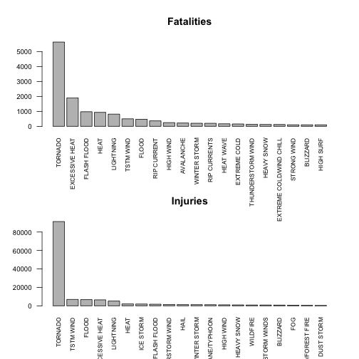
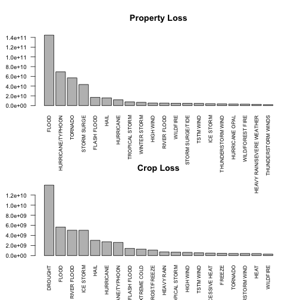

The influences of severse weather events on public health and economic problems in USA
========================================================

## Synopsis
In this report, we explore the NOAA Storm Database and answer some basic questions about severe weather events. Event records from the year 1950 to the year 2011 are examined to extract information on the influences of various weather events. We mainly focus on two subjects of the influences, namely public health and economic problems. To be specific, fatalities and injuries, property loss and crop loss are calculated respectively to find what types of events are most harmful to public health and what types of events cause most economic loss.

## Data Processing

```r
data <- read.csv("repdata-data-StormData.csv") # read in data

cleanData <- subset(data, !is.na(PROPDMG) & !is.na(CROPDMG), select = c("FATALITIES", "INJURIES", "PROPDMG", "PROPDMGEXP", "CROPDMG", "CROPDMGEXP", "EVTYPE")) # clean data and get the data we are interested in

Fatalities <- aggregate(cleanData$FATALITIES, by = list(cleanData$EVTYPE), sum) # calculate total fatalities according to event type

topFatal <- Fatalities[order(Fatalities$x, decreasing = TRUE), ][1:20, ] # find out the events cause most fatalities

Injuries <- aggregate(cleanData$INJURIES, by = list(cleanData$EVTYPE), sum)

topInjuries <- Injuries[order(Injuries$x, decreasing = TRUE), ][1:20, ]

loss <- NULL
cleanData$PROPDMGEXP <- as.character(cleanData$PROPDMGEXP)
cleanData$CROPDMGEXP <- as.character(cleanData$CROPDMGEXP)

unique(cleanData$PROPDMGEXP) # deal with data exponential 
```

```
##  [1] "K" "M" ""  "B" "m" "+" "0" "5" "6" "?" "4" "2" "3" "h" "7" "H" "-"
## [18] "1" "8"
```

```r
cleanData$PROPDMGEXP[cleanData$PROPDMGEXP == "+"] <- 0
cleanData$PROPDMGEXP[cleanData$PROPDMGEXP == "-"] <- 0
cleanData$PROPDMGEXP[cleanData$PROPDMGEXP == "0"] <- 1
cleanData$PROPDMGEXP[cleanData$PROPDMGEXP == "1"] <- 10
cleanData$PROPDMGEXP[cleanData$PROPDMGEXP == "2"] <- 100
cleanData$PROPDMGEXP[cleanData$PROPDMGEXP == "3"] <- 1000
cleanData$PROPDMGEXP[cleanData$PROPDMGEXP == "4"] <- 10000
cleanData$PROPDMGEXP[cleanData$PROPDMGEXP == "5"] <- 100000
cleanData$PROPDMGEXP[cleanData$PROPDMGEXP == "6"] <- 1000000
cleanData$PROPDMGEXP[cleanData$PROPDMGEXP == "7"] <- 10000000
cleanData$PROPDMGEXP[cleanData$PROPDMGEXP == "8"] <- 100000000
cleanData$PROPDMGEXP[cleanData$PROPDMGEXP == "?"] <- 0
cleanData$PROPDMGEXP[cleanData$PROPDMGEXP == "B"] <- 1e+9
cleanData$PROPDMGEXP[cleanData$PROPDMGEXP == "H"] <- 100
cleanData$PROPDMGEXP[cleanData$PROPDMGEXP == "K"] <- 1000
cleanData$PROPDMGEXP[cleanData$PROPDMGEXP == "M"] <- 1e+6
cleanData$PROPDMGEXP[cleanData$PROPDMGEXP == "h"] <- 100
cleanData$PROPDMGEXP[cleanData$PROPDMGEXP == "K"] <- 1000
cleanData$PROPDMGEXP[cleanData$PROPDMGEXP == "m"] <- 1e+6
cleanData$PROPDMGEXP[cleanData$PROPDMGEXP == ""] <- 0
cleanData$PROPDMGEXP[is.na(cleanData$PROPDMGEXP)] <- 0

cleanData$PROPLOSS <- as.numeric(cleanData$PROPDMGEXP) * cleanData$PROPDMG


unique(cleanData$CROPDMGEXP)
```

```
## [1] ""  "M" "K" "m" "B" "?" "0" "k" "2"
```

```r
cleanData$CROPDMGEXP[cleanData$CROPDMGEXP == "0"] <- 1
cleanData$CROPDMGEXP[cleanData$CROPDMGEXP == "2"] <- 100
cleanData$CROPDMGEXP[cleanData$CROPDMGEXP == "?"] <- 0
cleanData$CROPDMGEXP[cleanData$CROPDMGEXP == "B"] <- 1e+9
cleanData$CROPDMGEXP[cleanData$CROPDMGEXP == "K"] <- 1000
cleanData$CROPDMGEXP[cleanData$CROPDMGEXP == "M"] <- 1e+6
cleanData$CROPDMGEXP[cleanData$CROPDMGEXP == "k"] <- 1000
cleanData$CROPDMGEXP[cleanData$CROPDMGEXP == "m"] <- 1e+6
cleanData$CROPDMGEXP[cleanData$CROPDMGEXP == ""] <- 0
cleanData$CROPDMGEXP[is.na(cleanData$CROPDMGEXP)] <- 0

cleanData$CROPLOSS <- as.numeric(cleanData$CROPDMGEXP) * cleanData$CROPDMG

cleanData$TOTALLOSS <- cleanData$CROPLOSS + cleanData$PROPLOSS

propLoss <- aggregate(cleanData$PROPLOSS, by = list(cleanData$EVTYPE), sum)
cropLoss <- aggregate(cleanData$CROPLOSS, by = list(cleanData$EVTYPE), sum)
totalLoss <- aggregate(cleanData$TOTALLOSS, by = list(cleanData$EVTYPE), sum)
topPropLoss <- propLoss[order(propLoss$x, decreasing = TRUE), ][1:20, ]
topCropLoss <- cropLoss[order(cropLoss$x, decreasing = TRUE), ][1:20, ]
topTotalLoss <- totalLoss[order(totalLoss$x, decreasing = TRUE), ][1:20, ]
```

## Results
The results of the analysis are presented below.


```r
par(mfrow=c(2,1))
barplot(topFatal$x, names.arg = topFatal$Group.1, main = "Fatalities", cex.axis = 0.8, cex.names = 0.7, las = 2)
barplot(topInjuries$x, names.arg = topInjuries$Group.1, main = "Injuries", cex.axis = 0.8, cex.names = 0.7, las = 2)
```

 

The top 20 events that cause the most fatalities and injuries are shown above. As can be seen from the plots above, Tornado obviously outnumbers other events in fatalities and injuries. Other events cause significant fatalities are Excessive Heat, Flash Flood, etc.


```r
par(mfrow=c(2,1))
barplot(topPropLoss$x, names.arg = topPropLoss$Group.1, main = "Property Loss", cex.axis = 0.8, cex.names = 0.7, las = 2)
barplot(topCropLoss$x, names.arg = topCropLoss$Group.1, main = "Crop Loss", cex.axis = 0.8, cex.names = 0.7, las = 2)
```

 

The top 20 events that cause the largest property loss and crop loss are shown above. Flood stands out as the event causes the largest property loss and Drought stands out as the event causes the largest crop loss.


```r
barplot(topTotalLoss$x, names.arg = topTotalLoss$Group.1, main = "Total Loss", cex.axis = 0.8, cex.names = 0.7, las = 2)
```

 

From the viewpoint of overall loss, Flood outnumbers all the other events. Hurricane/Typhoon, Tornado and Storm surge are also significant in causing economic loss.

## Reference
https://rpubs.com/JidigamRaviteja/ReproducibleResearch is used as the reference of some R code.
